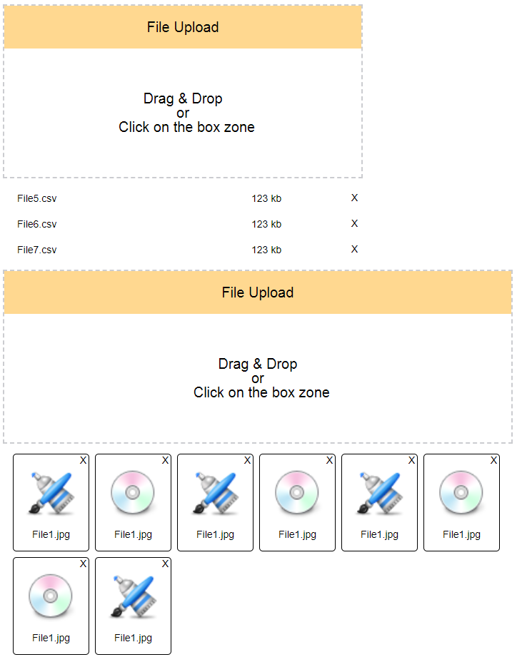

# File & Image Uploader (with drag & drop)

***

## Описание

+ В зависимости от свойств компонента Upload ('file' или 'image'), компонент будет рендерить результат загрузки в виде списка или в виде плиток с превью изображением.
+ Можно устанавливать у компонента

### Лайф версия доступна по [ссылке](https://topus009.github.io/uploader/)

***

## Customizing Upload Component

| property | type | value |
| ------ | ------ | ------ |
| type | @string | 'file' or 'image' |
| width | @array[string, number] | ['%', 90] |
| minWidth | @array[string, number] | ['px', 320] |
| value | @array[...objects] | ['px', 320] |

```js
// value array
[
  {
    name: 'File1.csv',
    size: 123,
    type: 'csv',
    res: null,
  },
  {
    name: 'File1.png',
    size: 123,
    type: 'png',
    res: 'data:image/png;base64,iVBORw0KGgoAAAANSUhEU...',
  },
]
```
***

***
## ToDo:

+ Renaming files
+ Upload to server